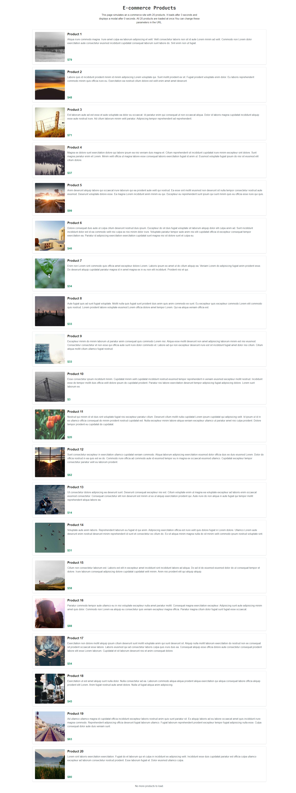

# Capture a Full-Height Screenshot

_The following example is a request we've prebuilt to show you Gaffa's capabilities on our_ [_demo site._](https://demo.gaffa.dev) _**You can run this request right now in the**_ [_**Gaffa API Playground**_](https://gaffa.dev/dashboard/playground?templateId=screenshot_ecommerce)_**.**_

Gaffa can also capture screenshots at any point during your interaction for use in your app or to work out exactly what was shown at a given time. You can capture just what is shown, as if you were looking at the screen or the full height of the page.

## API Request

The request below uses the [POST endpoint](../../../api-reference/post-v1-browser-requests.md) to open the demo site on the ecommerce page with 20 items, wait for and dismiss the dialog, scroll to the bottom of the page, and capture a full height screenshot.

```json
{
  "url": "https://demo.gaffa.dev/simulate/ecommerce?loadTime=3&showModal=true&modalDelay=0&itemCount=20",
  "proxy_location": null,
  "async": false,
  "max_cache_age": 0,
  "settings": {
    "record_request": false,
    "actions": [
      {
        "type": "wait",
        "selector": "div[role=\"dialog\"]",
        "timeout": 10000
      },
      {
        "type": "click",
        "selector": "[data-testid=\"accept-all-button\"]"
      },
      {
        "type": "wait",
        "selector": "[data-testid^=\"product-1\"]",
        "timeout": 5000
      },
      {
        "type": "scroll",
        "percentage": 100
      },
      {
        "type": "capture_screenshot",
        "size": "fullscreen"
      }
    ]
  }
}
```

## Actions


[wait.md](../actions/wait.md)



[click.md](../actions/click.md)



[scroll.md](../actions/scroll.md)



[capture-screenshot.md](../actions/capture-screenshot.md)


## Response

The full-height export screenshot of the page showing all items.

<figure><figcaption><p>Gaffa's full height screenshot</p></figcaption></figure>
